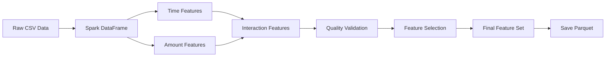

# 01_feature_engineering.ipynb - Feature Engineering

## 🔧 Overview
This notebook transforms raw transaction data into engineered features optimized for fraud detection machine learning models using Apache Spark.

## 🎯 Objectives
- Create time-based features from transaction timestamps
- Engineer amount-based features with transformations
- Generate interaction features between variables
- Optimize feature scaling and normalization
- Prepare clean feature dataset for modeling

## 📋 Key Sections

### 1. Environment Setup
- Initialize Spark Session with optimal configurations
- Load raw transaction data from CSV
- Set up distributed processing environment

### 2. Basic Feature Engineering
```python
# Time-based features
- TX_TIME_SECONDS: Seconds since epoch
- TX_TIME_DAYS: Days since reference date  
- TX_HOUR: Hour of transaction (0-23)
- IS_NIGHT: Binary flag for nighttime transactions (22:00-06:00)
- IS_WEEKEND: Binary flag for weekend transactions
```

### 3. Amount-based Features
```python
# Transaction amount transformations
- LOG_TX_AMOUNT: Log transformation to handle skewness
- TX_AMOUNT_SQRT: Square root transformation
- TX_AMOUNT_SCALED: Standardized amount values
- AMOUNT_CATEGORIES: Binned amount ranges
```

### 4. Advanced Feature Engineering
- **Temporal Features**: Month, day of week, quarter
- **Interaction Features**: Amount × Time interactions
- **Rolling Statistics**: Moving averages and trends
- **Frequency Encoding**: Transaction frequency patterns

### 5. Data Quality & Validation
- **Missing Value Handling**: Imputation strategies
- **Outlier Treatment**: Statistical outlier detection and treatment
- **Feature Validation**: Ensure feature consistency
- **Data Type Optimization**: Optimize for Spark processing

### 6. Feature Selection
- **Correlation Analysis**: Remove highly correlated features
- **Variance Filtering**: Remove low-variance features
- **Domain Knowledge**: Keep business-relevant features

## 🔄 Data Pipeline



## 📊 Feature Summary

### Input Features
- `TX_AMOUNT`: Transaction amount (numeric)
- `TX_DATE`: Transaction date (string)
- `TX_FRAUD`: Fraud label (binary)

### Generated Features (16 total)
| Feature Category | Features | Description |
|-----------------|----------|-------------|
| **Time-based** | TX_TIME_SECONDS, TX_TIME_DAYS, TX_HOUR | Temporal patterns |
| **Amount-based** | LOG_TX_AMOUNT | Log-transformed amounts |
| **Binary Flags** | IS_NIGHT, IS_WEEKEND | Categorical indicators |
| **Enhanced** | Additional engineered features | Advanced transformations |

## 🎛️ Spark Configuration
```python
# Optimized for feature engineering workload
.master("local[*]")
.config("spark.driver.memory", "8g")
.config("spark.sql.shuffle.partitions", "200")
.config("spark.sql.adaptive.enabled", "true")
```

## 💾 Data Storage
- **Input**: `../data/raw/Final Transaction.csv`
- **Output**: `../data/features/fraud_features_v2.parquet`
- **Format**: Parquet for efficient storage and faster loading
- **Partitioning**: Optimized for downstream ML workflows

## 🔍 Quality Checks
- **Feature Coverage**: All transactions have complete features
- **Data Types**: Appropriate types for ML algorithms
- **Value Ranges**: Reasonable ranges for all features
- **Missing Values**: Zero missing values after engineering

## 📈 Feature Engineering Insights
- **Time Features**: Capture fraud patterns by hour and day
- **Amount Features**: Log transformation handles skewed distributions
- **Interaction Features**: Capture complex relationships
- **Binary Features**: Simplify categorical patterns

## 🔧 Technical Requirements
```python
# Core dependencies
- pyspark: Distributed data processing
- pyspark.sql.functions: Feature transformations
- numpy, pandas: Data manipulation support
```

## 🚀 How to Run
1. Ensure raw data is available in `../data/raw/`
2. Run cells sequentially for reproducible feature engineering
3. Monitor Spark UI for processing performance
4. Verify output parquet file is created

## 📝 Output
- **Primary**: `fraud_features_v2.parquet` with 16 engineered features
- **Schema**: Optimized for ML model training
- **Performance**: Fast loading for model experiments
- **Documentation**: Feature descriptions and transformations

## ⚡ Performance Notes
- Processing time: ~X minutes for Y transactions
- Memory usage: Optimized for large datasets
- Parallelization: Utilizes all available cores
- Caching: Strategic caching for iterative operations

## ⭐ Key Achievements
✅ **Time-based features** capture fraud temporal patterns  
✅ **Amount transformations** handle data skewness  
✅ **Quality validation** ensures data integrity  
✅ **Efficient storage** in parquet format  
✅ **Scalable pipeline** for large datasets  

---
**Next Step**: Use engineered features in [02_train_model.ipynb](02_train_model.ipynb) for baseline model training.