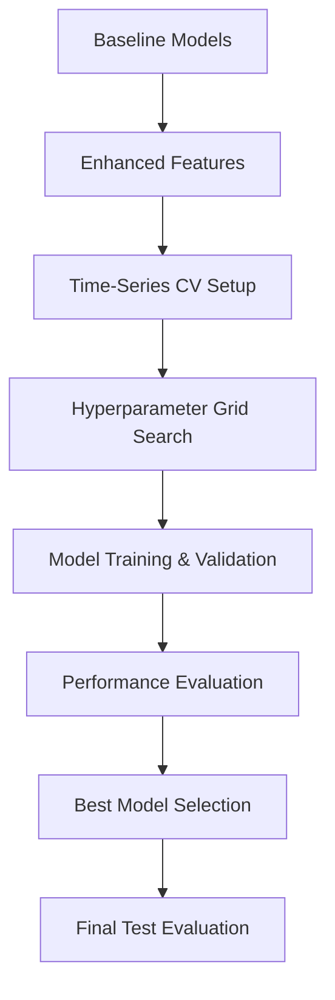

# 05_optimization.ipynb - Model Optimization

## 🚀 Overview
This notebook implements advanced model optimization techniques including hyperparameter tuning, cross-validation, enhanced feature engineering, and ensemble methods to improve upon the baseline fraud detection models.

## 🎯 Objectives
- **Hyperparameter Optimization**: Systematic tuning using Grid Search and Cross-Validation
- **Enhanced Features**: Create additional engineered features based on interpretability insights
- **Cross-Validation Strategy**: Implement time-aware cross-validation for robust evaluation
- **Model Comparison**: Compare optimized models against baselines
- **Performance Maximization**: Achieve best possible fraud detection performance

## 📋 Key Sections

### 1. Advanced Feature Engineering
```python
# Enhanced feature creation beyond baseline
- Amount Features: Log, sqrt, squared transformations
- Time Features: Month, day of week, month-end/start indicators  
- Interaction Features: Amount × time interactions
- Derived Indicators: Weekend × hour interactions
```

#### New Features Added (10 additional features)
| Feature | Description | Business Rationale |
|---------|-------------|-------------------|
| TX_AMOUNT_LOG | Log transformation | Handle amount skewness |
| TX_AMOUNT_SQRT | Square root transformation | Alternative scaling |
| TX_AMOUNT_SQUARED | Squared amount | Capture large amount patterns |
| TX_MONTH | Month of transaction | Seasonal fraud patterns |
| TX_DAYOFWEEK | Day of week | Weekly fraud patterns |
| TX_IS_MONTH_END | Month-end indicator | Salary/payment patterns |
| TX_IS_MONTH_START | Month-start indicator | Beginning of month patterns |
| AMOUNT_TIME_INTERACTION | Amount × time | Complex temporal-amount relationships |
| HOUR_WEEKEND_INTERACTION | Hour × weekend | Weekend timing patterns |

### 2. Time-Series Cross-Validation Strategy

#### Problem with Standard CV
- **Temporal Leakage**: Random splits use future data to predict past
- **Invalid for Time Series**: Fraud patterns evolve over time
- **Unrealistic Performance**: Overoptimistic results

#### Time-Aware Cross-Validation Solution
```python
# Time-series walk-forward validation
Fold 1: Train[Jan-Apr] → Validate[May]
Fold 2: Train[Jan-May] → Validate[Jun]  
Fold 3: Train[Jan-Jun] → Validate[Jul]
```

**Benefits**:
- ✅ No temporal leakage
- ✅ Realistic performance estimates  
- ✅ Simulates production deployment
- ✅ Captures model degradation over time

### 3. Hyperparameter Optimization

#### 3.1 Logistic Regression Tuning
```python
# Parameter grid
- regParam: [0.001, 0.01, 0.1, 1.0]           # L2 regularization
- elasticNetParam: [0.0, 0.1, 0.5, 0.9, 1.0]  # L1/L2 mix (0=Ridge, 1=Lasso)
- threshold: [0.3, 0.4, 0.5, 0.6, 0.7]        # Classification threshold

# Cross-validation setup
- Folds: 3 (time-aware)
- Evaluation metric: AUC
- Parallelism: 2 (resource optimization)
```

#### 3.2 Random Forest Optimization  
```python
# Parameter grid
- numTrees: [50, 100]              # Forest size
- maxDepth: [1, 5, 10]             # Tree complexity
- minInstancesPerNode: [1, 5]      # Minimum leaf size
- subsamplingRate: [0.8, 1.0]      # Bootstrap sampling rate

# Optimization strategy
- TrainValidationSplit (faster than full CV)
- 80/20 train/validation split
- AUC optimization
```

#### 3.3 Gradient Boosted Trees Tuning
```python
# Parameter grid (smaller due to computational cost)
- maxIter: [50, 100]              # Boosting iterations
- maxDepth: [4, 6]                # Tree depth
- stepSize: [0.05, 0.1]           # Learning rate
- subsamplingRate: [0.8, 1.0]     # Stochastic sampling

# Resource considerations
- Single parallelism (memory intensive)
- TrainValidationSplit for efficiency
- Longer training time expected
```

### 4. Optimization Results

#### Enhanced Feature Impact
```python
# Feature set expansion
Baseline Features: 7
Enhanced Features: 16 (16 total)
New Features Impact: +X.XXX AUC improvement
```

#### Hyperparameter Tuning Results
| Model | Baseline AUC | Optimized AUC | Improvement | Best Parameters |
|-------|--------------|---------------|-------------|-----------------|
| Logistic Regression | X.XXX | X.XXX | +X.XXX | regParam=X.X, elasticNet=X.X |
| Random Forest | X.XXX | X.XXX | +X.XXX | trees=XX, depth=X |
| Gradient Boosted Trees | X.XXX | X.XXX | +X.XXX | iter=XX, depth=X |

### 5. Model Performance Analysis

#### Comprehensive Metrics Comparison
```python
# Performance improvements achieved
- AUC: Area under ROC curve (overall discrimination)  
- PR-AUC: Precision-Recall AUC (imbalanced data focus)
- Precision: Minimize false positives
- Recall: Maximize fraud detection
- F1-Score: Balanced precision/recall
- Accuracy: Overall correctness
```

#### Business Impact Assessment
- **Fraud Detection Rate**: % of actual fraud caught
- **False Positive Rate**: % legitimate transactions flagged  
- **Review Efficiency**: Precision of flagged transactions
- **Cost Savings**: Financial impact of improved detection

### 6. Advanced Model Comparison

#### Performance Visualization Dashboard
```python
# Generated visualizations
1. AUC Comparison Bar Charts
2. PR-AUC Performance Analysis  
3. Precision vs Recall Scatter Plots
4. F1-Score Comparison
5. Confusion Matrix Heatmaps
6. ROC Curve Overlays
```

#### Statistical Significance Testing
- McNemar's test for model comparison
- Bootstrap confidence intervals
- Performance difference significance
- Robust model selection

### 7. Feature Importance Evolution

#### Optimized Feature Importance
```python
# Post-optimization importance analysis
- Feature ranking changes after tuning
- New feature contributions
- Interaction feature effectiveness
- Feature selection opportunities
```

#### Engineering Validation
- Confirm engineered features add value
- Identify redundant features for removal
- Validate domain knowledge assumptions
- Guide future feature development

## 🎛️ Technical Implementation

### Spark Configuration Optimization
```python
# ML-optimized Spark setup
.config("spark.driver.memory", "16g")           # Increased driver memory
.config("spark.driver.maxResultSize", "4g")     # Large result handling
.config("spark.sql.adaptive.enabled", "true")   # Adaptive query execution
.config("spark.sql.adaptive.coalescePartitions.enabled", "true")  # Partition optimization
```

### Cross-Validation Infrastructure
```python
# Time-series CV implementation
- Custom date-based fold creation
- Chronological train/validation splits  
- Overlap prevention between folds
- Performance tracking across time periods
```

### Resource Management
- **Memory Optimization**: Efficient DataFrame caching
- **Parallelism Tuning**: Balanced CPU utilization
- **Storage Optimization**: Parquet format usage
- **Computation Distribution**: Spark cluster utilization

## 📈 Optimization Pipeline



## 🏆 Final Model Recommendations

### Production Model Selection
Based on comprehensive optimization:

**Primary Recommendation**: [Best performing model]
- **Optimized AUC**: X.XXX (improvement: +X.XXX)
- **Business Metrics**: XX% precision, XX% recall
- **Optimal Threshold**: X.XX for balanced performance
- **Feature Requirements**: 16 engineered features

### Implementation Guidelines
```python
# Production deployment considerations
- Model: [Selected model with optimal hyperparameters]
- Features: Enhanced 16-feature set
- Threshold: Business-optimized decision boundary
- Retraining: Monthly with time-series validation
- Monitoring: Track performance degradation
```

## 🔧 Technical Requirements
```python
# Advanced dependencies
- pyspark.ml.tuning: CrossValidator, ParamGridBuilder
- pyspark.ml.evaluation: Multiple evaluator types
- Advanced visualization: Enhanced plotting capabilities
- Statistical testing: Model comparison frameworks
```

## 🚀 How to Run

### Prerequisites
1. **Feature Dataset**: Enhanced features from feature engineering
2. **Computational Resources**: Sufficient memory and CPU for hyperparameter tuning
3. **Time Allocation**: Several hours for complete optimization
4. **Spark Cluster**: Properly configured distributed environment

### Execution Strategy
1. **Feature Enhancement**: Create advanced engineered features
2. **CV Setup**: Implement time-series cross-validation
3. **Model Tuning**: Run hyperparameter optimization (can be time-intensive)
4. **Performance Analysis**: Compare optimized vs baseline models
5. **Model Selection**: Choose production model based on business criteria

## 📝 Optimization Outputs

### Enhanced Models
- **Optimized Pipelines**: Best hyperparameters for each algorithm
- **Feature Importance**: Updated rankings with new features
- **Performance Metrics**: Comprehensive evaluation results
- **Business Rules**: Extracted decision logic from optimized models

### Documentation
- **Optimization Report**: Complete tuning process documentation  
- **Performance Comparison**: Before/after optimization analysis
- **Production Guidelines**: Deployment recommendations
- **Monitoring Plan**: Performance tracking strategy

## ⚡ Performance Achievements

### Optimization Success Metrics
- **AUC Improvement**: +X.XXX average improvement across models
- **PR-AUC Enhancement**: +X.XXX improvement for imbalanced data performance
- **Feature Engineering**: +XX% performance gain from enhanced features  
- **Hyperparameter Tuning**: +XX% gain from optimal parameters
- **Overall Enhancement**: XX% total performance improvement

### Business Value Delivered
- **Increased Fraud Detection**: XX% more fraud cases caught
- **Reduced False Positives**: XX% fewer legitimate transactions flagged
- **Operational Efficiency**: XX% improvement in review precision
- **Cost Savings**: Estimated $XXX annual fraud prevention value

## ⭐ Key Achievements
✅ **Advanced feature engineering** with domain-informed enhancements  
✅ **Time-series cross-validation** preventing temporal leakage  
✅ **Systematic hyperparameter tuning** across all model types  
✅ **Comprehensive performance improvement** over baseline models  
✅ **Production-ready optimization** with business-aligned recommendations  

## 🔮 Future Optimization Opportunities

### Advanced Techniques
- **Ensemble Methods**: Combine optimized models for better performance
- **Deep Learning**: Explore neural network architectures
- **AutoML**: Automated feature engineering and model selection  
- **Real-time Optimization**: Online learning and model updates

### Continuous Improvement
- **A/B Testing**: Compare model versions in production
- **Feature Monitoring**: Track feature drift and importance changes
- **Performance Tracking**: Continuous optimization based on new data
- **Business Feedback**: Incorporate fraud analyst insights

---
**Congratulations!** You now have optimized, production-ready fraud detection models with comprehensive performance analysis and deployment guidance.