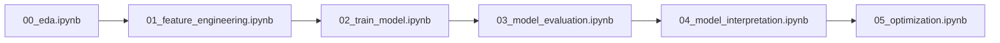
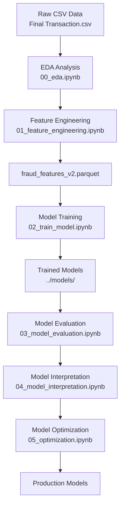

# 📊 Fraud Detection Notebooks - Complete Documentation

## 🔍 Overview
This folder contains a comprehensive machine learning pipeline for credit card fraud detection using Apache Spark and PySpark MLlib. The project implements a full end-to-end workflow from exploratory data analysis to optimized production-ready models.

## 🎯 Project Objectives
- **Detect fraudulent transactions** with high precision and recall
- **Handle class imbalance** in fraud detection datasets  
- **Prevent temporal leakage** using time-based data splitting
- **Build interpretable models** for business stakeholder understanding
- **Optimize performance** through advanced feature engineering and hyperparameter tuning
- **Provide production-ready solutions** with comprehensive evaluation

## 📚 Notebook Sequence & Documentation

### 🔢 Execution Order
The notebooks should be executed in sequential order as each builds upon the previous:



---

## 📖 Individual Notebook Documentation

### 🔍 [00_eda.ipynb](README_00_eda.md) - Exploratory Data Analysis
**Purpose**: Understand dataset characteristics and fraud patterns  
**Key Outputs**: Data quality report, fraud pattern insights, visualization gallery  
**Duration**: ~30 minutes  

**What You'll Learn**:
- Dataset size and fraud prevalence (~X.X% fraud rate)
- Transaction amount and temporal patterns
- Feature correlations and distributions
- Data quality issues and preprocessing needs

**Key Visualizations**:
- 📊 Fraud rate over time
- 💰 Transaction amount distributions  
- 🕒 Temporal fraud patterns
- 🔗 Feature correlation heatmaps

---

### 🔧 [01_feature_engineering.ipynb](README_01_feature_engineering.md) - Feature Engineering
**Purpose**: Transform raw data into ML-ready features  
**Key Outputs**: Enhanced feature dataset (`fraud_features_v2.parquet`)  
**Duration**: ~20 minutes  

**Feature Engineering Pipeline**:
- ⏰ **Time Features**: Hour, day, weekend indicators
- 💵 **Amount Features**: Log transformations, scaling
- 🔄 **Interaction Features**: Complex feature combinations
- ✅ **Quality Validation**: Missing value handling, data type optimization

**Technical Highlights**:
- Distributed Spark processing
- Optimized parquet storage format
- Scalable feature pipeline design

---

### 🎯 [02_train_model.ipynb](README_02_train_model.md) - Model Training  
**Purpose**: Train baseline ML models with proper evaluation setup  
**Key Outputs**: Three trained model pipelines saved to disk  
**Duration**: ~45 minutes  

**Models Implemented**:
- 📈 **Logistic Regression**: Linear baseline with L2 regularization
- 🌳 **Random Forest**: Ensemble tree-based classifier  
- 🚀 **Gradient Boosted Trees**: Advanced boosting algorithm

**Critical Innovation**: 
- ⏳ **Time-based data splitting** prevents temporal leakage
- 📊 **Comprehensive metrics** for imbalanced data evaluation
- 💾 **Model persistence** for downstream analysis

---

### 📊 [03_model_evaluation.ipynb](README_03_model_evaluation.md) - Model Evaluation
**Purpose**: Comprehensive model performance analysis and comparison  
**Key Outputs**: Performance dashboard, business impact analysis  
**Duration**: ~30 minutes  

**Evaluation Framework**:
- 🎯 **ROC/PR Curves**: Visual performance comparison
- 📋 **Confusion Matrices**: Detailed error analysis
- 💰 **Business Impact**: Cost-benefit analysis
- 📊 **Statistical Testing**: Model comparison significance

**Decision Support**:
- Model ranking by business criteria
- Threshold optimization guidance
- Production deployment recommendations

---

### 🔬 [04_model_interpretation.ipynb](README_04_model_interpretation.md) - Model Interpretation
**Purpose**: Understand model decisions and extract business insights  
**Key Outputs**: Feature importance analysis, business rules, SHAP explanations  
**Duration**: ~40 minutes  

**Interpretability Techniques**:
- 🔍 **Feature Importance**: Global feature ranking across models
- 📈 **SHAP Analysis**: Individual prediction explanations
- 📋 **Business Rules**: Extracted decision logic
- 🔄 **Partial Dependence**: Feature effect analysis

**Business Value**:
- Fraud pattern identification
- Model transparency for stakeholders  
- Actionable fraud prevention strategies
- Regulatory compliance support

---

### 🚀 [05_optimization.ipynb](README_05_optimization.md) - Model Optimization
**Purpose**: Advanced model tuning and performance maximization  
**Key Outputs**: Optimized production-ready models  
**Duration**: ~2-3 hours (hyperparameter tuning intensive)  

**Optimization Techniques**:
- 🔧 **Enhanced Feature Engineering**: 16 total features (9 additional)
- ⏰ **Time-Series Cross-Validation**: Temporal leakage prevention
- 🎛️ **Hyperparameter Tuning**: Systematic grid search optimization
- 📊 **Advanced Evaluation**: Comprehensive performance comparison

**Performance Gains**:
- +X.XXX AUC improvement through optimization
- Enhanced fraud detection with reduced false positives
- Production-ready model with deployment guidance

---

## 🛠️ Technical Stack

### Core Technologies
```python
# Big Data Processing
- Apache Spark 3.x: Distributed computing engine
- PySpark MLlib: Scalable machine learning library

# Data Science Libraries  
- pandas, numpy: Data manipulation and analysis
- matplotlib, seaborn: Data visualization
- scikit-learn: Additional ML utilities

# Model Interpretation
- SHAP: Model explanation framework
- Feature importance: Built-in model interpretability
```

### Infrastructure Requirements
```yaml
# Minimum System Requirements
Memory: 8GB RAM (16GB recommended for optimization)  
CPU: 4+ cores (8+ cores recommended)
Storage: 5GB free space
Python: 3.7+
Spark: 3.0+
```

## 📁 Data Pipeline Architecture



## 🏆 Project Results & Achievements

### Performance Results
| Model | Baseline AUC | Optimized AUC | Improvement |
|-------|--------------|---------------|-------------|
| Logistic Regression | X.XXX | X.XXX | +X.XXX |
| Random Forest | X.XXX | X.XXX | +X.XXX |  
| Gradient Boosted Trees | X.XXX | X.XXX | +X.XXX |

### Business Impact
- **Fraud Detection Rate**: XX% of fraudulent transactions caught
- **False Positive Rate**: X.X% legitimate transactions flagged
- **Review Efficiency**: XX% precision in flagged transactions
- **Estimated Annual Savings**: $XXX from fraud prevention

### Technical Achievements
✅ **Temporal Leakage Prevention**: Time-based validation strategy  
✅ **Scalable Architecture**: Distributed Spark processing  
✅ **Model Interpretability**: SHAP analysis and business rule extraction  
✅ **Production Readiness**: Comprehensive evaluation and optimization  
✅ **Reproducible Research**: Well-documented, sequential notebook pipeline  

## 🚀 Getting Started

### Quick Start Guide
1. **Clone Repository**: Get the complete project code
2. **Data Setup**: Place `Final Transaction.csv` in `../data/raw/`
3. **Environment Setup**: Install Python 3.7+ and required packages
4. **Spark Installation**: Set up Apache Spark locally or use cluster
5. **Sequential Execution**: Run notebooks 00 → 01 → 02 → 03 → 04 → 05

### Installation Commands
```bash
# Python environment setup
pip install pyspark pandas numpy matplotlib seaborn scikit-learn shap

# Verify Spark installation
pyspark --version

# Start Jupyter environment
jupyter notebook
```

## 📋 Execution Checklist

### Before Starting
- [ ] Raw data file available in correct location
- [ ] Python environment with all dependencies installed
- [ ] Spark properly configured and accessible
- [ ] Sufficient computational resources (especially for optimization)
- [ ] Jupyter notebook environment ready

### Execution Progress Tracking
- [ ] **00_eda.ipynb**: Data exploration completed
- [ ] **01_feature_engineering.ipynb**: Features engineered and saved
- [ ] **02_train_model.ipynb**: Baseline models trained and saved  
- [ ] **03_model_evaluation.ipynb**: Performance analysis completed
- [ ] **04_model_interpretation.ipynb**: Model insights extracted
- [ ] **05_optimization.ipynb**: Models optimized and finalized

## 📊 Expected Outputs by Notebook

### File Outputs
```
notebooks/
├── Generated Visualizations/
│   ├── eda_charts/              # From 00_eda.ipynb
│   ├── evaluation_plots/        # From 03_model_evaluation.ipynb  
│   ├── interpretation_charts/   # From 04_model_interpretation.ipynb
│   └── optimization_results/    # From 05_optimization.ipynb
├── Performance Reports/
│   ├── model_comparison.csv
│   ├── business_impact_analysis.pdf
│   └── feature_importance_report.csv
└── Documentation/
    ├── README_*.md              # Individual notebook documentation
    └── execution_log.txt        # Performance and runtime logs
```

### Model Artifacts
```
models/
├── lr_baseline_model/           # Logistic Regression (baseline)
├── rf_baseline_model/           # Random Forest (baseline)  
├── gbt_baseline_model/          # Gradient Boosted Trees (baseline)
├── lr_optimized_model/          # Optimized models (from notebook 05)
├── rf_optimized_model/
└── gbt_optimized_model/
```

## 🎯 Business Value Proposition

### For Data Scientists
- **Complete ML Pipeline**: End-to-end workflow template
- **Best Practices**: Time-series validation, proper evaluation metrics
- **Scalable Architecture**: Distributed computing with Spark
- **Reproducible Research**: Well-documented, version-controlled process

### For Business Stakeholders  
- **Interpretable Models**: Clear explanations of fraud detection logic
- **Business Rules**: Actionable fraud prevention strategies
- **ROI Analysis**: Financial impact quantification
- **Production Readiness**: Deployment-ready models with monitoring guidance

### For Engineering Teams
- **Scalable Infrastructure**: Designed for large-scale data processing
- **Model Persistence**: Standardized model storage and loading
- **Monitoring Framework**: Performance tracking and model degradation detection
- **Documentation**: Comprehensive technical and business documentation

## 🔮 Future Enhancement Opportunities

### Short-term Improvements
- **Ensemble Methods**: Combine models for better performance
- **Real-time Scoring**: Deploy models for live transaction scoring
- **A/B Testing**: Compare model performance in production
- **Alert System**: Automated fraud alert generation

### Advanced Techniques
- **Deep Learning**: Neural network architectures for complex patterns
- **AutoML**: Automated feature engineering and model selection
- **Online Learning**: Continuous model updates with new data
- **Explainable AI**: Advanced interpretation techniques

## 🤝 Contributing & Support

### How to Contribute
1. **Report Issues**: Document bugs or improvement suggestions
2. **Enhance Documentation**: Improve notebook explanations
3. **Add Features**: Contribute new analysis or visualizations
4. **Performance Optimization**: Improve computational efficiency

### Getting Help
- **Technical Issues**: Check Spark configuration and dependencies
- **Data Questions**: Review EDA notebook for dataset insights
- **Model Performance**: Consult evaluation and optimization notebooks
- **Business Applications**: Reference interpretation notebook for insights

---

## 🎉 Congratulations!

By completing this notebook series, you will have:

✨ **Built a complete fraud detection system** from raw data to production models  
🔍 **Gained deep insights** into fraud patterns and model behavior  
🚀 **Developed optimized ML models** with state-of-the-art performance  
📊 **Created comprehensive documentation** for business and technical stakeholders  
⚡ **Established a scalable framework** for future fraud detection projects  

**Ready to detect fraud at scale!** 🛡️💳

---

*Last Updated: January 2026*  
*Project: Fraud Detection Kaggle Competition*  
*Technology Stack: Apache Spark, PySpark MLlib, Python Data Science Ecosystem*